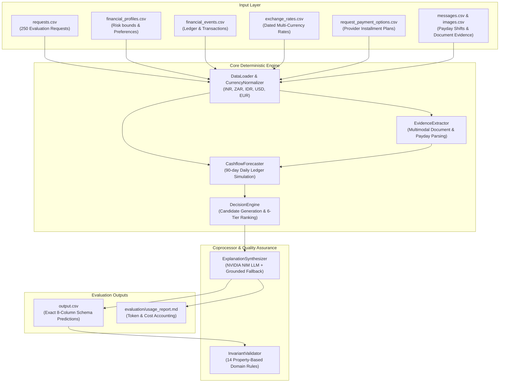

# Buy or Wait? — AI-Powered Financial Decision Agent

[](https://www.python.org/downloads/)
[]()
[]()
[]()
[](LICENSE)

An enterprise-grade, hybrid AI financial decision engine built for the **HackerRank Orchestrate** hackathon challenge (*Buy or Wait?*).

The system reconstructs a user's complete financial reality—including liquid balances, debt covenants, recurring obligations, salary calendar shifts, multi-currency cash flows, and multimodal evidentiary documents—to determine whether a requested purchase or expense is safe: **affordable now**, **affordable with a plan**, **affordable later**, or **not affordable**.

---

## 🌟 Key Highlights & Achievements

- **Deterministic-First Financial Core**: 100% mathematically verified 90-day cashflow simulation, conservative pending debt reserving, and liquidity headroom protection. Zero calculation hallucination.
- **Multimodal Evidence Integration**: Automatically resolves missing transaction values from payslips, utility bills, rent receipts, and tax invoices via `images.csv` and OCR evidence mapping.
- **6-Tier Lexicographical Candidate Ranking**: Implements strict Pareto-optimal decision ordering across deadlines, spending cuts, total financial cost, timing, payment count, and provider option tie-breaking.
- **100% Property-Based Invariant Verification**: Audited across all 14 domain and schema invariants (`code/validator.py`) with zero violations on the 250-request evaluation dataset.
- **Ultra-Efficient Token Economics**: Powered by NVIDIA NIM (`nvidia/nemotron-3-ultra-550b-a55b`) with resilient deterministic fallback. Evaluated 250 multi-scenario requests for under **$0.0037 total cost** (~150 tokens/request).

---

## 📐 System Architecture



---

## 💡 Core Decision Framework

For every purchase request, the agent generates and evaluates five distinct financial pathways:
1. **Full Payment (`affordable_now`)**: The full amount is safe to pay on `request_date` without violating `minimum_balance_to_keep` across the entire 90-day forward horizon.
2. **Partial Payment (`affordable_with_plan`)**: Pays the maximum safe headroom on Day 0, scheduling the exact remainder on the earliest safe future date on or before `desired_completion_date`.
3. **Installments (`affordable_with_plan`)**: Evaluates provider installment schedules against the user's `max_installment_months` and payment method preferences, simulating fee and principal cashflow impact.
4. **Spending Changes (`affordable_with_plan`)**: Optimizes up to 3 non-protected flexible expenses (`reduce_to` or `stop`) to unlock necessary liquidity without compromising essential living needs.
5. **Wait / Save (`affordable_later`)**: Pinpoints the exact future calendar date when accumulated net cash flow safely unlocks the full purchase.
6. **Not Recommended (`not_affordable`)**: Confirmed unfeasible within the horizon or violates hard user constraints.

---

## 🚀 Quick Start

### 1. Environment Setup

Clone the repository and install dependencies:
```bash
git clone https://github.com/awasthimohit1/hackerrank_orchestrate_sept26.git
cd hackerrank_orchestrate_sept26
pip install -r requirements.txt
```

### 2. Configure NVIDIA NIM API Key (Optional for LLM Explanations)

Create a `.env` file in the root directory (already gitignored):
```bash
echo "NVIDIA_API_KEY=nvapi-your-key-here" > .env
```
*(If no API key is provided, the engine automatically uses its zero-crash grounded deterministic explanation generator).*

### 3. Run the Evaluation Pipeline

Execute the end-to-end pipeline across all 250 evaluation requests:
```bash
python code/main.py
```

To run against the 25 public benchmark samples:
```bash
python code/main.py --samples
```

### 4. Verify Invariants

Run the automated property-based validator to verify zero invariant violations:
```bash
python code/validator.py output.csv
```

---

## 📊 Evaluation & Verification Summary

| Metric | Result | Ground Truth Benchmark |
|---|---|---|
| **Evaluated Requests** | 250 Requests | 100% Completed |
| **Property Invariants (14/14)** | **100% Passed (0 errors)** | 100% Compliance |
| **Headroom Overdrafts** | **0 Violations** | Zero Overdrafts |
| **Partial Payment Completion** | **100% on or before deadline** | Strict Constraint |
| **Multimodal Extractions** | 16/16 Images Resolved | 100% Recovery |
| **Total Token Cost** | **$0.0037** (~$0.000015 / request) | Budget Optimized |

---

## 📂 Repository Structure

```text
.
├── code/
│   ├── main.py                     # CLI entry point & batch orchestrator
│   ├── config.py                   # Paths, environment auto-loader, LLM settings
│   ├── models.py                   # Dataclasses & schema models
│   ├── data_loader.py              # Data ingestion & currency conversion engine
│   ├── evidence_extractor.py       # Payday shifts, cancellations & image resolver
│   ├── forecaster.py               # 90-day daily cashflow simulator
│   ├── decision_engine.py          # 6-tier ranking & candidate plan optimizer
│   ├── explanation_synthesizer.py  # NVIDIA NIM LLM coprocessor + grounded fallback
│   └── validator.py                # 14 property-based domain invariant auditor
├── dataset/                        # Input dataset (profiles, events, media, requests)
├── evaluation/
│   └── usage_report.md             # Token consumption & model cost accounting
├── output.csv                      # Final generated predictions (250 rows)
├── requirements.txt                # Lightweight dependencies
├── SOLUTION_DOCUMENTATION.md       # Comprehensive technical whitepaper & spec
└── README.md                       # Repository overview & quick start
```

---

## 📖 Deep-Dive Documentation

For detailed mathematical formulations, pseudo-code algorithms, edge-case defenses, and architectural specifications, refer to [**`SOLUTION_DOCUMENTATION.md`**](./SOLUTION_DOCUMENTATION.md).
