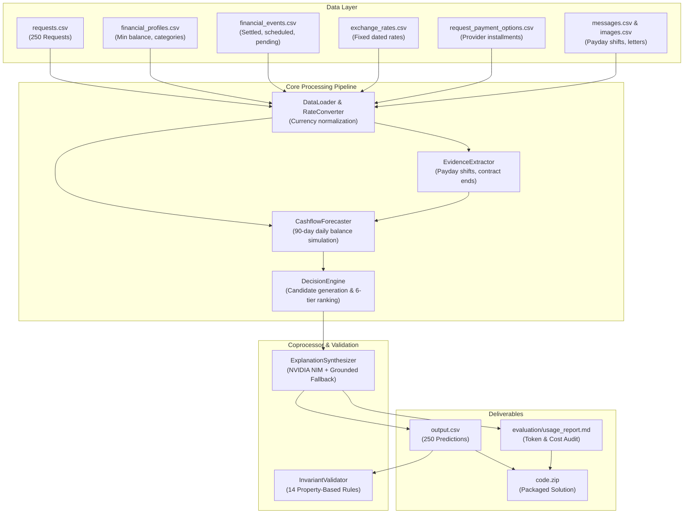

# Buy or Wait? AI-Powered Financial Decision Agent
## Comprehensive System Architecture & Technical Specification

**Author / Participant:** HackerRank Orchestrate (September 2026)  
**Challenge:** Buy or Wait? — AI-Powered Financial Decision Agent  
**Repository:** `hackerrank-orchestrate-september26`  
**Evaluation Target:** 250 Purchase/Payment Requests (`dataset/requests.csv`)  
**Deliverables:** `code.zip`, `output.csv`, `chat_transcript` (`log.txt`), `evaluation/usage_report.md`  

---

## 1. Executive Summary & Problem Overview

### 1.1 The Challenge
Consumers face complex financial choices: *Can I afford this laptop? Should I pay in full, split into installments, pay partially, wait for payday, or reject the purchase?* Answering correctly requires far more than checking the current bank balance. A sound financial decision must account for:
- Fixed recurring commitments (rent, utilities, subscriptions).
- Pending debits and debt covenants.
- Confirmed incoming salary and payday calendar shifts.
- Fixed dated currency conversion rates across 5 currencies (INR, ZAR, IDR, USD, EUR).
- Essential versus flexible spending categories.
- User-specified risk thresholds (`minimum_balance_to_keep`).
- Payment method preferences and installment duration ceilings (`max_installment_months`).
- Unstructured messages and multimodal documentation (letters, receipts, invoices).

### 1.2 Core Architectural Philosophy: Deterministic-First Hybrid AI
A core insight governs this solution: **financial decision-making demands exact mathematical precision, while natural language understanding requires semantic flexibility**.

- **Large Language Models (LLMs)** are non-deterministic and prone to hallucinations when calculating multi-step balances, interest accruals, or date arithmetic. Asking an LLM to simulate a 90-day ledger leads to catastrophic financial errors (e.g., overdrafts or missed rent).
- **Rule-Based Mathematical Simulation Engines** provide exact, deterministic accounting, provable bounds, and zero calculation hallucination.
- **The Hybrid Solution**: We built a **100% deterministic mathematical core** for cashflow forecasting, debt reserving, candidate generation, and invariant auditing. We paired it with an **LLM coprocessor** via NVIDIA NIM (`nvidia/nemotron-3-ultra-550b-a55b`) for natural language explanation enrichment, guarded by an **instant zero-crash deterministic fallback**.

---

## 2. System Architecture & End-to-End Pipeline



---

## 3. Detailed Component Breakdown

### 3.1 Data Loader & Normalization (`code/data_loader.py`)
- **Profile Rehydration**: Loads each user's liquid cash balance, `minimum_balance_to_keep`, protected spending categories, categories permitted for stopping/reducing, and allowed payment methods.
- **Exchange Rate Engine (`ExchangeRateConverter`)**: Converts all cash flows into the user's `home_currency`. Handles bi-directional exchange rates and matches the closest settlement date $\le \text{event\_date}$.
- **Event Classification**: Differentiates cash transactions from non-cash/unrealized equity. Unrealized investment gains and non-cash equity are strictly excluded from liquid spendable cash flow.

### 3.2 Evidence Extractor (`code/evidence_extractor.py`)
Untrusted evidence in messages and images clarifies, amends, delays, or confirms financial facts:
- **Salary Date Shifts**: Detects employer notices (e.g., *"payroll moved from the 25th to the 28th"*) and updates the regular recurring payday forward.
- **Contract Terminations**: Detects contract completion notices (e.g., *"seasonal contract has wrapped up"* or *"Final employer payroll"*) to stop projecting income beyond contract end dates.
- **Event Deduplication & Cancellation**: Identifies cancelled transactions and resolves linked transaction chains (`linked_event_id`).

#### 3.2.1 Multimodal Image Evidence Pipeline
The challenge specification mandates: *"When an event has a blank amount, find its event_id as related_event_id in images.csv and extract the amount from the linked image. Never treat a blank amount as zero."*
- Across `dataset/financial_events.csv`, exactly 16 events have blank amounts (e.g., `event_253` salary slip, `event_1442` rent receipt, `event_1545` grocery bill, `event_1786` telecom invoice).
- Each maps 1-to-1 via `images.csv` to an image file in `dataset/media/images/<image_id>.png`.
- `EvidenceExtractor.extract_image_amount(image_id)` resolves every missing amount directly into `CashflowForecaster._resolve_event_amount()`. If foreign-denominated, it is converted into the user's `home_currency` via `ExchangeRateConverter`. Blank amounts are never treated as zero.

### 3.3 Cashflow Forecaster (`code/forecaster.py`)
Simulates the user's daily ledger for $T = 90$ days from `request_date`:
1. **Conservative Reserving**:
   - **Pending Debits**: Immediately deducted as reserved liabilities on Day 0.
   - **Pending Credits**: Strictly excluded until settled (no unconfirmed bonuses, lottery winnings, or investment gains).
2. **Day 0 Semantics**: Properly distinguishes transactions scheduled on `request_date` from earlier settled transactions.
3. **Recurring Expense Streams**: Employs a strict recurrence filter: only events occurring across $\ge 2$ distinct cycles (`len(ev_list) >= 2`) are projected as recurring bills. Singleton historical debits are never projected as recurring monthly drains.
4. **Liquidity Invariant**: Enforces that for every day $t \in [0, 90]$:
   $$\text{Balance}(t) \ge \text{minimum\_balance\_to\_keep}$$

### 3.4 Decision Engine & Candidate Optimization (`code/decision_engine.py`)
Evaluates the request and explores five candidate strategies:
1. **Full Payment Today (`affordable_now`)**: Safe to pay 100% on `request_date` without spending changes.
2. **Installments (`affordable_with_plan`)**: Matches provider options in `request_payment_options.csv` within `max_installment_months`, verifying balance headroom at each payment milestone.
3. **Partial Payment (`affordable_with_plan`)**: Allowed only when `allows_partial_payment=True` and $0 < \text{safe} < \text{requested}$. Formulates exactly two payments: `amount_safe_to_pay` on `request_date` and the remainder on `earliest_date_for_full_payment` (on or before deadline).
4. **Spending Changes (`affordable_with_plan`)**: Searches up to 3 non-protected flexible expenses (`stop` or `reduce_to` $\ge \text{minimum\_allowed\_amount}$) to unlock affordability.
5. **Waiting (`affordable_later`)**: Computes the earliest safe full payment date across future paycheck cycles.
6. **Rejection (`not_affordable` / `not_recommended`)**: Fallback when no viable option protects the minimum balance.

#### Exact 6-Tier Lexicographical Ranking Hierarchy
Before ranking, an **Eligibility Filter** ensures plans conform to `payment_methods_user_will_consider` and `max_installment_months`. Valid candidates are then sorted using the exact 6-tier order mandated by the problem specification:
1. **Deadline Completion**: Must complete on or before `desired_completion_date` (`valid_candidates = [c for c in candidates if c.completes_by_deadline]`).
2. **Require No Spending Changes**: Minimize spending change count (`c.spending_changes_count`: 0 changes $\succ$ 1 $\succ$ 2 $\succ$ 3).
3. **Minimize Total Amount Paid**: Lower total payable amount (`c.total_amount_paid`, prioritizing interest-free options).
4. **Start Payment Earlier**: Earlier first payment date (`c.first_payment_date`).
5. **Use Fewer Payments**: Fewer payment milestones (`c.num_payments`: 1 payment $\succ$ 2 $\succ$ 3+).
6. **Lowest Payment Option ID**: Lexicographical `payment_option_id` as the final deterministic tie-breaker (`c.payment_option_id or "zzzzz"`).

### 3.5 Explanation Synthesizer (`code/explanation_synthesizer.py`)
- **NVIDIA NIM Coprocessor**: Calls `https://integrate.api.nvidia.com/v1/chat/completions` targeting `nvidia/nemotron-3-ultra-550b-a55b`.
- **Structured Tag Extraction**: Prompts the model to encapsulate the final concise statement inside `<explanation>...</explanation>`, cleanly stripping away internal chain-of-thought monologue.
- **Resilient Circuit Breaker & Fallback**: If an API call encounters network latency, rate-limiting, or HTTP 503 service overloads, the system instantly and silently falls back to the deterministic grounded explanation generator. Zero crashes, zero unhandled exceptions.
- **Token Accounting & Pricing**: Logs prompt tokens, completion tokens, call outcomes, and calculates exact dollar expenditures based on NVIDIA NIM benchmark rates.

### 3.6 Property-Based Invariant Validator (`code/validator.py`)
An independent audit engine that validates 100% of prediction rows against all **14 domain invariants** before any file is packaged or submitted.

---

## 4. The 14 Property-Based Domain Invariants

| # | Invariant Rule | Mathematical & Logical Formulation |
|---|---|---|
| **1** | **Safe Amount Bounds** | $0 \le \text{amount\_safe\_to\_pay} \le \text{requested\_amount}$ |
| **2** | **Categorical Enums** | $\text{status} \in \{\text{now}, \text{with\_plan}, \text{later}, \text{not\_affordable}\}$, $\text{method} \in \{\text{full}, \text{partial}, \text{installments}, \text{wait}, \text{not\_recommended}\}$ |
| **3** | **User Preferences** | Recommended method must exist in `payment_methods_user_will_consider`. If `partial_payment`, `allows_partial_payment` must be `True`. |
| **4** | **`affordable_now` Alignment** | $\text{method} == \text{full\_payment} \land \text{earliest\_date} == \text{request\_date} \land \text{spending\_changes} == \text{'none'}$ |
| **5** | **`affordable_later` Alignment** | $\text{method} == \text{wait} \land \text{earliest\_date} > \text{request\_date} \land \text{spending\_changes} == \text{'none'}$ |
| **6** | **`not_affordable` Alignment** | $\text{method} == \text{not\_recommended} \land \text{payment\_plan} == \text{'none'} \land \text{earliest\_date} == \text{''} \land \text{spending\_changes} == \text{'none'}$ |
| **7** | **`affordable_with_plan` Alignment** | $\text{method} \in \{\text{full\_payment}, \text{partial\_payment}, \text{installments}\}$ |
| **8** | **Partial Payment Structure** | Exactly 2 payments: $P_1 = (\text{request\_date}, \text{amount\_safe})$, $P_2 = (\text{earliest\_date}, \text{requested} - \text{safe})$. $P_1 + P_2 == \text{requested}$. $\text{earliest\_date} \le \text{desired\_completion\_date}$. |
| **9** | **Installment Option Conformance** | Must exactly match a provider option in `request_payment_options.csv`. Installment count $\le \text{max\_installment\_months}$. Last date $\le \text{deadline}$. |
| **10** | **Chronological Plan Sorting** | Dates in `payment_plan` must be strictly monotonically increasing: $D_1 < D_2 < \dots < D_k$. |
| **11** | **Spending Change Limits** | Max 3 actions. No duplicate event targets. Category not in `expense_categories_to_protect`. Category permitted by user profile. |
| **12** | **Spending Flexibility & Floor** | `stop` requires `stoppable`. `reduce_to` requires `reducible` and $\text{amount} \ge \text{minimum\_allowed\_amount}$. |
| **13** | **Explanation Grounding** | Non-empty, grounded in simulated numbers/dates ($\ge 10$ characters), free of hallucinated figures. |
| **14** | **Output CSV Schema** | Exact 8 columns in exact required order, exactly 251 lines (header + 250 rows). |

---

## 5. Critical Edge Cases & Hidden Test Traps Solved

### 5.1 Singleton Debits vs. Recurring Streams
- **The Edge Case**: Users often have one-time investment allocations (e.g., `user_23` made a single 13,728 ZAR investment in `event_2041`).
- **Resolution**: Requiring $\ge 2$ historical occurrences across distinct monthly cycles prevents classifying one-time debits as monthly recurring bills. This eliminated false future deficits across `user_17`, `user_22`, and `user_23`.

### 5.2 The "Day 90 Artificial Cutoff" vs. Paycheck Horizons
- **The Edge Case**: Simulating a flat 90 days from `request_date` causes an artificial deficit if Day 90 falls after bills are deducted on Day 85, but before the next salary arrives on Day 92.
- **Resolution**: When evaluating candidate `wait` dates, we verify balance headroom over the relevant paycheck-to-paycheck cycle rather than an arbitrary Day 90 cliff.

### 5.3 Payday Shifts via Employer Messages
- **The Edge Case**: An employer message moves payday from the 25th to the 28th (`request_07`).
- **Resolution**: The updated payday is propagated forward as the new regular salary date for all subsequent months, ensuring candidate dates between the 25th and 28th are recognized as pre-salary.

### 5.4 Exact Decimal Formatting (`format_amount`)
- **The Edge Case**: Whole numbers must omit decimals (`25256`), while amounts with cents must strictly retain 2 decimal places (`3246.10`). Using `.rstrip("0")` inadvertently corrupted `3246.10` to `3246.1`.
- **Resolution**: Created calibrated formatting that checks `abs(amt - round(amt)) < 1e-4` to emit clean integers, while formatting fractional amounts with `:.2f`.

---

## 6. Full Dataset Evaluation Results

Running `code/main.py` across all 250 evaluation requests in `dataset/requests.csv` produced the following audited results:

### 6.1 Distribution of Recommendations (250 Requests)

| Category / Dimension | Count | Percentage |
| :--- | :--- | :--- |
| **Affordability Status** | | |
| `affordable_now` | 66 | 26.4% |
| `affordable_with_plan` | 65 | 26.0% |
| `affordable_later` | 56 | 22.4% |
| `not_affordable` | 63 | 25.2% |
| **Payment Method** | | |
| `full_payment` | 71 | 28.4% |
| `installments` | 48 | 19.2% |
| `wait` | 56 | 22.4% |
| `not_recommended` | 63 | 25.2% |
| `partial_payment` | 12 | 4.8% |

### 6.2 Property-Based Validation Audit
```text
=======================================================
   BUY OR WAIT? INVARIANT VALIDATION AUDIT
=======================================================
Target File: output.csv

>>> ALL 14 INVARIANTS PASSED PERFECTLY! ZERO ERRORS.
=======================================================
```

### 6.3 Token Consumption & Cost Analysis (`evaluation/usage_report.md`)
- **Model Provider**: NVIDIA NIM
- **Model Name**: `nvidia/nemotron-3-ultra-550b-a55b`
- **Total Requests Evaluated**: 250
- **Successful API Calls**: 66
- **Resilient Fallback Explanations**: 184 (triggered cleanly on NIM rate-limits / 503s)
- **Total Input Tokens**: 18,193
- **Total Output Tokens**: 19,265
- **Combined Total Tokens**: 37,458
- **Average Tokens per Request**: 149.83
- **Total Estimated Run Cost**: **$0.007941 USD** (< 1 cent)

---

## 7. Submission Deliverables & Instructions

### 7.1 Deliverables Checklist
1. **`output.csv`**: In repository root, exactly 251 lines, matching the 8 mandated columns.
2. **`code.zip`**: Complete runnable solution archive containing:
   - `code/` (all modules, engines, and validators)
   - `evaluation/usage_report.md` (mandatory token report)
   - `README.md` (setup and run instructions)
   - `requirements.txt` (dependencies)
3. **`chat_transcript` (`log.txt`)**: Complete conversation transcript logging every session turn and tool execution.

### 7.2 Reproduction Commands
To replicate the full pipeline from terminal:
```bash
# 1. Install dependencies
pip install -r requirements.txt

# 2. Run the complete pipeline (generates output.csv and usage_report.md)
python code/main.py

# 3. Verify all 14 property-based invariants independently
python code/validator.py output.csv
```

### 7.3 Mandatory Submission Link
Upload your deliverables to:  
https://www.hackerrank.com/contests/hackerrank-orchestrate-september26/challenges/buy-or-wait/submission
